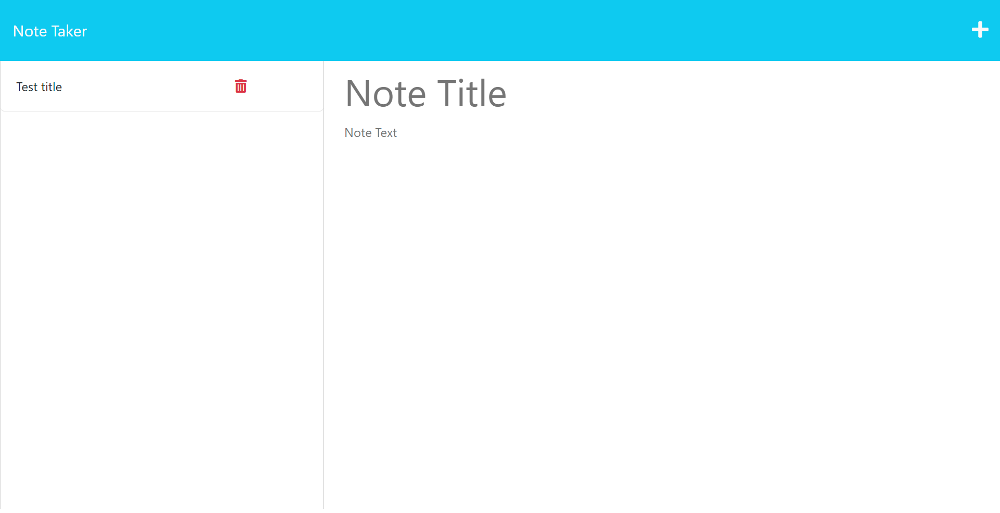

# note-taker

## Description

This is a Node.js, Express.js application that can be used to write and save notes. Note data is retrieved and saved from a JSON file and the application is deployed using Heroku.

## Table of Contents
- [Installation](#installation)
- [Usage](#usage)
- [Credits](#credits)
- [License](#license)

## Installation

The deployed application can be used [here.](https://note-taker-956-ad1ff648c92a.herokuapp.com/)

## Usage
The application shows existing notes in the left-hand column, plus empty fields to enter a new note title and the note’s text in the right-hand column. A new note title and the note’s text can be entered and then saved by utilizing the save icon at the top of the page. The newly saved note appears in the left-hand column with the other existing notes. When an existing note is clicked on in the list in the left-hand column, then that note appears in the right-hand column. The delete icon by each note can delete that specific note. Below is a screenshot of the deployed page:

## Credits

Starter code from The University of Texas at Austin. 

## License

This project is covered under the MIT License.
